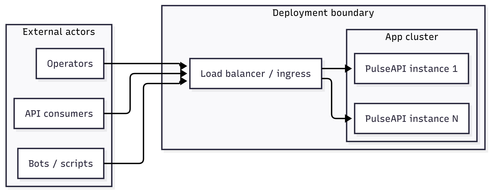
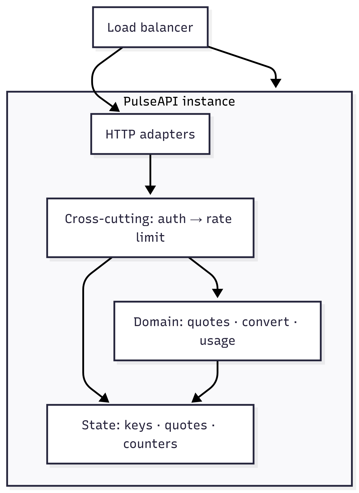
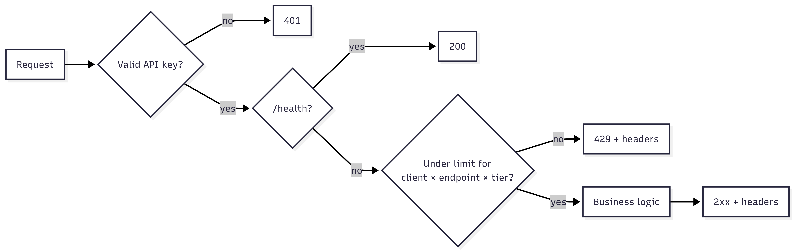
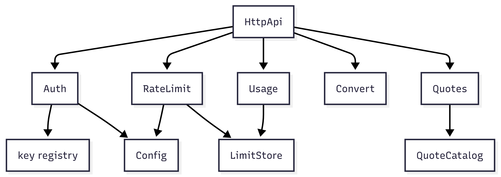

# High-Level Design (Reference)

> **Purpose:** Correct / PRD-aligned reference for learning.  
> **Companion:** `design/hld.md` = your proposed draft (keep iterating there).  
```text
Author: Cursor(Auto)
Version: 1
Application: PulseAPI
```
---

## 1. Problem Statement

### 1.1 What we are building
PulseAPI is a developer-facing HTTP API that serves inspirational quotes and a small set of related operations (lookup, create, batch fetch, and lightweight text processing). Third-party applications integrate via simple, versioned endpoints (`/v1/...`).

### 1.2 Who it is for
- **Primary:** API consumers (developers) integrating quotes/processing into their apps.
- **Same interface, different behavior:** automated clients (scripts/bots) calling the same APIs — often at higher volume and less polite about retries.
- **Operators (internal):** run and observe the service (logs/metrics). They are not a separate product audience with admin APIs in v1.

### 1.3 Core pain / goal
As usage grows, a few clients can starve others, raise cost, and destabilize the service. The product must remain **useful and fair**: predictable access, clear contracts, and transparent feedback when a client is throttled.

**Product goal:** a reliable quotes/processing API.  
**System-design goal (primary learning focus):** enforce **per-client, per-endpoint, per-tier** usage limits without breaking the experience for well-behaved clients.

---

## 2. Functional Requirements

### 2.1 Must-have capabilities

**A. Product surface (what the API does)**
1. Return a random quote.
2. Return a quote by id (or not-found).
3. Accept a new quote (with validation).
4. Run a lightweight text operation on input (`reverse` / `uppercase` / `wordcount`) with intentional processing cost.
5. Batch-fetch quotes by a list of ids (partial success allowed).
6. Expose a liveness/health check for infrastructure (no auth).

**B. Identity**
7. Authenticate protected endpoints with an API key that maps to a **client identity** and **tier** (Free / Standard / Premium). Missing/invalid key → reject before business work.

**C. Fair access (rate limiting)**
8. Enforce independent limits per **client × endpoint × tier** (e.g. exhausting convert quota must not block quote reads).
9. Evaluate limits **before** business logic; a rejected write must not create side effects (e.g. no quote created on 429).
10. On throttle: HTTP 429 plus client guidance (`Retry-After` and rate-limit headers). Same headers should appear on successful protected responses so clients can slow down proactively.
11. Let a client inspect **their own** current-window usage/remaining quotas via a usage API (counts must match enforcement). Reading usage must not consume quotas of other business endpoints (usage may have its own limit).
12. Health checks are **exempt** from authentication and per-client rate limits. They are intended for load balancers and monitoring; keeping them independent prevents cascading failures when auth or the limiter is unhealthy.

**D. Response quality**
13. Consistent JSON error shape with stable machine-readable codes and a request id for correlation.

### 2.2 Nice-to-have (out of v1 if needed)
1. Quotes (and optionally keys) survive process restart (durable store) — v1 may use seed/in-memory data.
2. Limits and related knobs adjustable without a full redesign of the API (configurability).
3. Richer operator tooling (dashboards, key rotation APIs) — explicitly later.

### 2.3 Explicit non-features
1. Billing, payments, or subscription management  
2. Self-service API key signup or admin dashboard UI  
3. Geographic routing or multi-region deployment  
4. OAuth or end-user login (API key only)  
5. Content moderation beyond basic validation  
6. Contractual SLA / uptime commitments  

---

## 3. Non-Functional Requirements

### 3.1 Performance & latency
1. Rate-limit check overhead: **&lt; 5 ms p99** (excluding business logic).
2. `GET /health`: **&lt; 50 ms p99**.
3. Quote read paths: **&lt; 100 ms p99** (excluding rate-limit check).
4. Convert path: **200–300 ms artificial delay** + small overhead (delay is a product requirement to make “expensive” endpoints meaningful).

### 3.2 Availability & reliability
1. Sustained max-rate traffic from one client must not take down the service or destroy experience for other clients.
2. Deployable as **multiple app instances** behind a load balancer.
3. Define behavior when rate-limit state is temporarily unavailable (**fail-open vs fail-closed** — decide later in design; requirement is that behavior is explicit and tested).
4. Process restart or mild clock skew must not permanently lock out a client or grant unbounded access.
5. Concurrent requests from the same client must not produce unbounded overshoot of the published limit (document acceptable tolerance later).

### 3.3 Scale & consistency targets
1. **Client isolation:** Client A’s usage/limits must not affect or leak into Client B’s.
2. **Cross-instance consistency:** With multiple instances, a single client’s effective limit remains correct within the agreed tolerance (requirement = consistency of enforcement).
3. **Initial production scale:** Since the PRD does not specify production scale, we assume an initial deployment serving approximately **1,000 active API clients**. Architecture should scale to roughly **10×** (~10k clients) without major redesign (see §5).
4. Hot-key awareness: design must remain correct when one client hammers one endpoint at the limit.

---

## 4. Assumptions & Constraints

> Since the PRD does not specify production scale, numbers in §5 are **design assumptions** for initial production (~1,000 active API clients; design for ~10× without major redesign). Revisit when real traffic exists.

### 4.1 Assumptions
1. **Read-heavy** traffic (~90%+ reads: random/by-id/batch/usage vs writes/convert).
2. Callers are **third-party apps** identified by **API keys** (not end-user logins).
3. **Initial production target:** Since the PRD does not specify production scale, we assume ~**1,000 monthly active API clients** (keys with meaningful traffic). The architecture should scale to roughly **10×** this size without major redesign — not a toy/sandbox-only deploy.
4. **Tier mix (assumed):** ~80% Free, ~15% Standard, ~5% Premium.
5. Organic traffic has **diurnal peaks** (e.g. morning/evening); use peak factor **~10×** average for provisioning headroom.
6. Some clients will **retry aggressively** after 429 (bots/scripts); the system must stay up under that behavior.
7. **Single region** for initial production; multi-region is out of scope (see §2.3).
8. Clocks are roughly synchronized (NTP); designs should still tolerate mild skew.

### 4.2 Constraints
1. **One deployable application service** for v1 (no microservice split required).
2. **API-key auth only** — no OAuth/user login.
3. Limits are **per client × per endpoint × per tier**, enforced before business logic.
4. Must be **horizontally scalable** (multiple instances behind a load balancer) with correct-enough limit enforcement across instances.
5. **Convert** remains intentionally expensive (artificial delay); capacity planning must treat it as a separate bottleneck from cheap reads.
6. No billing/subscription platform in-process (tiers are configuration, not a payments system).

### 4.3 Non-goals
Same as **§2.3** (billing, self-serve key signup/admin UI, multi-region, OAuth, deep moderation, contractual SLAs). Not repeated here.

---

## 5. Capacity Estimation

**Framing:** Since the PRD does not specify production scale, we assume an initial deployment serving approximately **1,000 active API clients**. The architecture should scale to roughly **10×** (~10k clients) without major redesign. Unit of scale = **API client (key)**, not consumer “DAU.”

| Planning target | Value | Notes |
|---|---|---|
| Monthly active clients | **1,000** | Assumed initial production (PRD silent on scale) |
| Horizon | Design for **~10× (10k clients)** without rewrite | Exact 10k sizing is future; see scale ladder below |

**Scale ladder (forward look — detail in §15):**  
current design → shared Redis (~10k) → sharding → distributed limiter (~100k) → edge/global limiting (millions).

### 5.1 Traffic (QPS / peak)

**Organic load**

| Step | Value |
|---|---|
| Active clients | **1,000** (assumption above) |
| Avg requests / client / day | **200** (integrations polling quotes + light writes) |
| Daily requests | 1,000 × 200 = **200,000** |
| **Average QPS** | 200,000 ÷ 86,400 ≈ **2.3 QPS** |
| **Organic peak QPS** | 2.3 × 10 ≈ **23 QPS** |
| Read : write(+convert) | ≈ **10 : 1** → peak writes/convert ≈ **~2 QPS** organic |

**Limit-derived / abuse load (must survive)**

Organic peak is easy; rate limiting exists for the ugly case.

| Scenario | Rough math | Implication |
|---|---|---|
| 1× Premium at cap on `GET .../random` | 500 / min ≈ **8.3 RPS** | Single hot client |
| 50× Free at cap on same endpoint | 50 × 30 / min ≈ **25 RPS** | Many small clients |
| Aggressive retries after 429 | Can multiply attempt rate; most should fail cheaply at the limiter | Limiter path must stay fast (&lt; 5 ms) |
| **Design headroom (initial prod)** | Survive **~100–200 QPS** of mostly limited traffic without collapse | Far above organic ~23 QPS |

**Little’s Law (convert concurrency):**  
**Concurrency ≈ arrival rate × service time.** Convert’s ~250 ms delay makes even modest RPS expensive in thread/handler terms.

| Step | Math |
|---|---|
| 10 Premium clients at convert cap | 10 × 50 / min = **500 convert / min** |
| Arrival rate | 500 ÷ 60 ≈ **8.3 req/s** |
| Service time | ~**0.25 s** |
| Avg in-flight convert work | 8.3 × 0.25 ≈ **~2** concurrent handlers |

Still fine at small scale; convert concurrency is the first resource to watch as clients grow.

### 5.2 Storage & growth

Split **business data** (product) from **operational data** (infrastructure) — different durability and scaling stories.

**Business data**
| Store | What | Footprint (order of magnitude) |
|---|---|---|
| Quotes | Catalog text + author + id | ~700 B/quote; seed 50; plan ~10k → **~7 MB**; 100k → **~70 MB** |
| Clients / keys | key → clientId, tier | ~1 KB/client → **~1 MB** at 1k; **~10 MB** at 10k |

Growth of quotes is low (creates are rate-limited). Not the scaling bottleneck.

**Operational data**
| Store | What | Footprint / notes |
|---|---|---|
| Rate-limit counters | Per client × endpoint × window | ≤ a few MB hot at 1k clients; tens of MB at 10k — size is small; **consistency across instances** drives shared store |
| Logs / metrics | Ops telemetry | Retention-dependent; out of core DB sizing for v1 |

**Conclusion:** data volume is small. Capacity risk is **QPS + convert concurrency + correct shared counters**, not terabytes of quotes.

### 5.3 Bandwidth / payload
Payloads are small JSON (quotes, short convert I/O). At ~23–200 QPS, bandwidth is **not** a bottleneck for initial production. Skip detailed bandwidth math unless batch sizes or payloads grow large.

## 6. High-Level Architecture Diagram

§1–5 answered **what** and **how big**. §6 answers **where traffic and logic sit** (topology + pipeline). It should not re-argue requirements — only place them in space.

Although PulseAPI instances are **stateless with respect to business logic**, rate limiting introduces **shared state** that must remain consistent across instances (prepares the path to a shared store such as Redis in §9/§11).

### 6.1 Context (external actors)

| Actor | Path | Rate-limited? |
|---|---|---|
| API consumers | `/v1/*` + API key | Yes, by tier |
| Bots / scripts | Same `/v1/*` | Yes (often louder) |
| Operators / LB probes | `/health` | No — LB and monitors must not depend on auth or the limiter (avoids cascading failure) |



```
flowchart LR
  subgraph Actors["External actors"]
    Dev["API consumers"]
    Bot["Bots / scripts"]
    Op["Operators"]
  end

  subgraph Edge["Deployment boundary"]
    LB["Load balancer / ingress"]
    subgraph Cluster["App cluster"]
      I1["PulseAPI instance 1"]
      IN["PulseAPI instance N"]
    end
  end

  Dev --> LB
  Bot --> LB
  Op --> LB
  LB --> I1
  LB --> IN
```

### 6.2 Container / component view

One deployable service (per §4.2). Logical layers inside each instance:



```
flowchart TB
  LB["Load balancer"] --> Inst

  subgraph Inst["PulseAPI instance"]
    HTTP["HTTP adapters"]
    Cross["Cross-cutting: auth → rate limit"]
    Biz["Domain: quotes · convert · usage"]
    State["State: keys · quotes · counters"]
  end

  LB --> HTTP --> Cross --> Biz
  Cross --> State
  Biz --> State
```

Business data (quotes, keys) vs operational data (counters, logs) — see §5.2. Shared vs local counters deferred to §9/§11; Phase 1 may keep all state in-process.

### 6.3 Request lifecycle & key interactions

**Canonical lifecycle (one place — sequences detail this in §10):**

```text
Request → LB → Authentication → Rate Limiter → Controller → Service → Repository/Store → Response
```

Enforcement order (from FR): **identity → limit check → business work**. Health short-circuits auth and limits.



```
flowchart TD
  R[Request] --> A{Valid API key?}
  A -->|no| E401[401]
  A -->|yes| H{/health?}
  H -->|yes| OKH[200]
  H -->|no| L{Under limit for<br/>client × endpoint × tier?}
  L -->|no| E429[429 + headers]
  L -->|yes| B[Business logic] --> OK[2xx + headers]
```

### 6.4 Design principles

| Principle | Meaning here |
|---|---|
| **Stateless app instances** | Any instance can serve any request; no sticky sessions required for business logic |
| **Shared rate-limit state** | Counters are the exception — must be consistent across instances at scale |
| **Fail fast before business logic** | Auth and limits reject before side effects (no quote on 429) |
| **Separation of cross-cutting concerns** | Auth and rate limiting apply uniformly; not reimplemented per controller |
| **Horizontal scalability** | Add instances behind LB; scale compute independently of catalog size |
| **Configuration over code** | Tier×endpoint limits and delays are config, not hardcoded per deploy |

## 7. Component Responsibilities

### Why this section exists (and what it must not do)

Earlier sections already fixed product rules (§1–2), NFRs (§3–4), and placement (§6). **§7 must not restate those.** Its job: **partition modules**, **justify the cut**, show **depends-on** edges.

### 7.1 Component list (partition + why)

| Module | Owns this seam | Why this cut | Maps to (Spring-ish) |
|---|---|---|---|
| **HttpApi** | Routes + DTO bind/validate | Keeps transport separate from domain and policy | `@RestController` |
| **Auth** | Key → `clientId`/`tier` or reject | Identity is a prerequisite for every protected call; resolve once | `Filter` / `Interceptor` |
| **RateLimit** | Allow/deny + rate headers | Cross-cutting: same policy on all protected endpoints; must run before business logic | `Filter` / `Interceptor` after Auth |
| **LimitStore** | Counter read/increment | Isolates operational state so adapters can swap (memory → Redis) without touching controllers | Port + adapter |
| **Quotes** | Catalog ops | Product domain; no knowledge of HTTP status or quota math | `@Service` + store |
| **Convert** | Text ops + delay | Expensive path isolated so capacity (Little’s Law) is visible | `@Service` |
| **Usage** | Read this client’s counters | Transparency without charging other endpoints’ buckets | Thin controller + LimitStore |
| **Health** | Liveness only | LB/monitors must not depend on Auth/RateLimit (cascading failure) | Outside Auth/RateLimit chain |
| **Config** | Tier×endpoint maxima, delays, seeds | Configuration over code | `@ConfigurationProperties` |

### 7.2 Ownership boundaries (seams)

| Seam | Owner | Neighbor must not |
|---|---|---|
| HTTP ↔ domain | HttpApi | Controllers do not increment counters or resolve tiers |
| Identity ↔ limits | Auth then RateLimit | RateLimit never parses keys; Auth never mutates counters |
| Limits ↔ domain | RateLimit before Quotes/Convert | Domain services assume “already allowed” |
| Limits ↔ persistence | RateLimit / Usage → LimitStore | LimitStore has no HTTP or DTO knowledge |
| Ops ↔ product | Health | Health not behind per-client limiter or auth |

### 7.3 Dependencies (call / data edges)



```
flowchart LR
  HttpApi --> Auth
  HttpApi --> RateLimit
  HttpApi --> Quotes
  HttpApi --> Convert
  HttpApi --> Usage
  Auth --> KeyMap["key registry"]
  RateLimit --> LimitStore
  Usage --> LimitStore
  Quotes --> QuoteCatalog
  RateLimit --> Config
  Auth --> Config
```

**Build order:**

1. HttpApi + Quotes + Convert + Health + in-memory catalogs  
2. Auth + key registry  
3. RateLimit + LimitStore  
4. Shared LimitStore when multi-instance correctness is required (§11)

## 8. API Design

HLD-level contract only — full field rules live in the PRD. Goal here: **surface**, **auth/errors**, **shapes that affect architecture**.

### 8.1 Resources & endpoints

| Method | Path | Auth | Rate-limited | Role |
|---|---|---|---|---|
| `GET` | `/health` | No | No | LB / monitoring liveness |
| `GET` | `/v1/quotes/random` | Yes | Yes | Primary read |
| `GET` | `/v1/quotes/{id}` | Yes | Yes | Point read |
| `POST` | `/v1/quotes` | Yes | Yes | Write (create) |
| `POST` | `/v1/convert` | Yes | Yes | Compute-heavy (artificial delay) |
| `POST` | `/v1/batch/quotes` | Yes | Yes | Multi-read; **1 request** toward batch limit regardless of id count |
| `GET` | `/v1/usage` | Yes | Yes (own bucket) | Inspect own window; must match enforcement |

**Why this surface:** one versioned product API (`/v1`) plus a separate ops probe (`/health`) so infrastructure checks never share fate with API-key or limiter failures.

**Tier × endpoint limits (60s window)** — values from PRD; enforced by RateLimit + Config:

| Endpoint | Free | Standard | Premium |
|---|---|---|---|
| `GET .../random`, `GET .../{id}` | 30 | 100 | 500 |
| `POST /v1/quotes` | 5 | 20 | 100 |
| `POST /v1/convert` | 5 | 15 | 50 |
| `POST /v1/batch/quotes` | 10 | 30 | 100 |
| `GET /v1/usage` | 10 | 30 | 60 |
| `GET /health` | Exempt | Exempt | Exempt |

### 8.2 Auth & error contract

**Auth**
- Header: `X-API-Key: <key>` → maps to `clientId` + tier.
- Missing/invalid → **401** before rate limit and before business logic.
- Invalid responses must not distinguish “malformed” vs “unknown” key (avoid key enumeration).

**Success path headers (protected endpoints):**  
`X-RateLimit-Limit`, `X-RateLimit-Remaining`, `X-RateLimit-Reset` on 2xx so clients can back off early.

**Throttle:** **429** + `Retry-After` + the same rate-limit headers. Rejected writes create **no** side effects.

**Standard error body (all 4xx/5xx):**

```json
{
  "error": {
    "code": "RATE_LIMIT_EXCEEDED",
    "message": "Human-readable explanation.",
    "requestId": "req-abc123"
  }
}
```

Stable `code` values: `VALIDATION_ERROR`, `UNAUTHORIZED`, `RATE_LIMIT_EXCEEDED`, `NOT_FOUND`, `INTERNAL_ERROR`. `requestId` appears in logs for correlation.

**Why a uniform error shape:** clients and operators parse one contract; rate-limit UX is headers + code, not ad-hoc bodies per endpoint.

### 8.3 Important request/response shapes

**Quote (read/create):** `{ "id", "text", "author" }` (+ `"status": "accepted"` on create 201).

**Convert:** request `{ "text", "operation" }` → response `{ "operation", "input", "result", "processingTimeMs" }` with 200–300 ms delay on success.

**Batch:** request `{ "ids": [1..10] }` → **200 with partial success** — each item is a quote or `{ "id", "error": "not_found" }`, plus `found` / `notFound` counts. Architecture note: one HTTP call, one limit debit; work scales with id count inside the service.

**Usage:** current window only; per-endpoint `limit` / `used` / `remaining` must match RateLimit/LimitStore — same source of truth as enforcement headers.

## 9. Data Model & Storage Design

### 9.1 Core entities / state
### 9.2 What must persist vs ephemeral
### 9.3 Storage placement (local vs shared; durability)

## 10. Core Request Flows (Sequence Diagrams)

### 10.1 Happy path
### 10.2 Auth failure
### 10.3 Rate-limited / rejected path

## 11. Scalability & Reliability

### 11.1 Bottlenecks & scaling approach
### 11.2 Multi-instance / shared state
### 11.3 Failure modes & recovery

## 12. Security

### 12.1 Authentication & identity
### 12.2 Authorization / abuse boundaries
### 12.3 Sensitive data handling

## 13. Observability

### 13.1 Logs
### 13.2 Metrics
### 13.3 Tracing / correlation (if needed)

## 14. Deployment

### 14.1 Runtime topology
### 14.2 Config & environments
### 14.3 Rollout / ops notes (brief)

## 15. Trade-offs / Future Improvements

### 15.1 Decisions & alternatives considered
### 15.2 Known limitations
### 15.3 Next scale / Phase 2+ ideas
